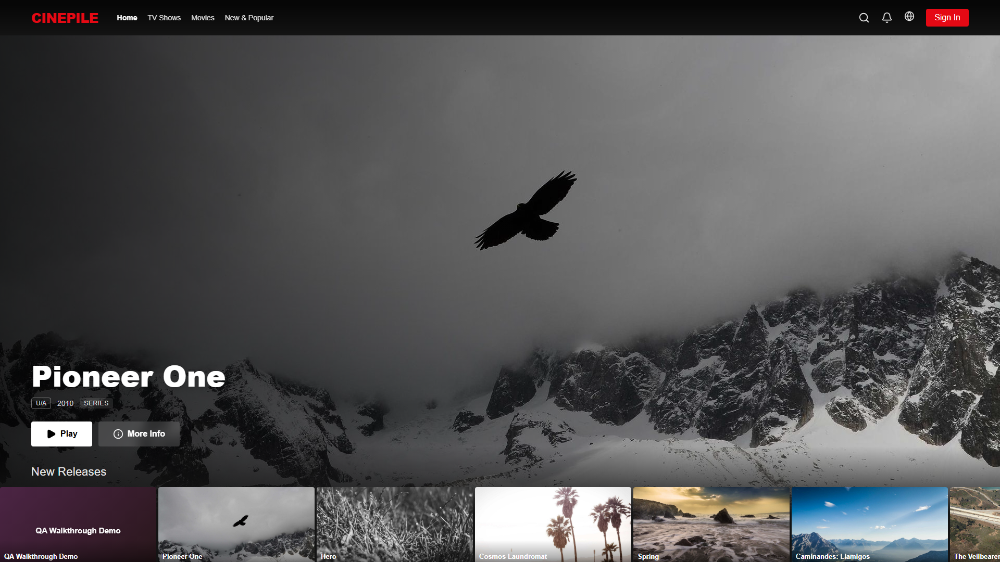
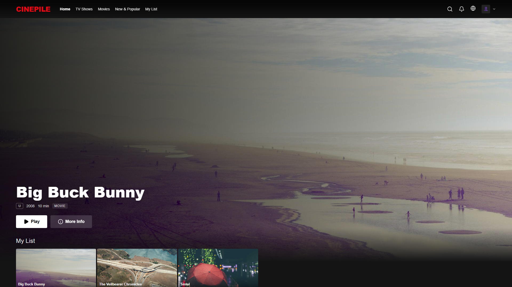
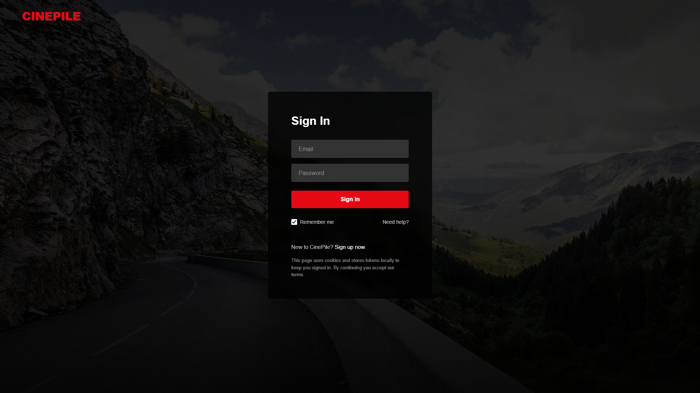
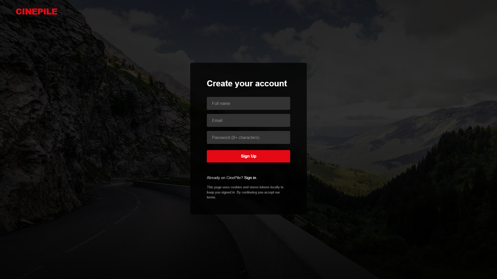
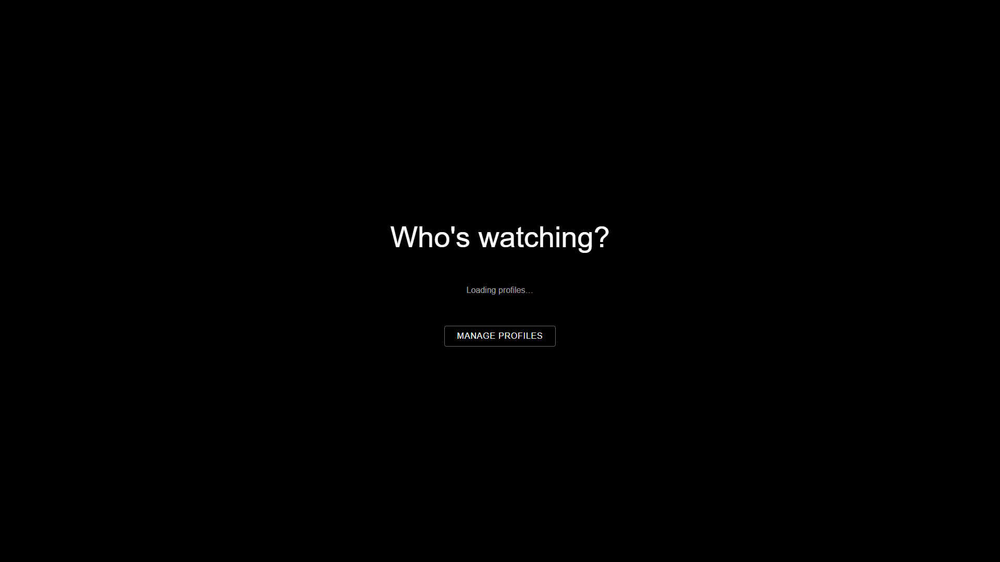
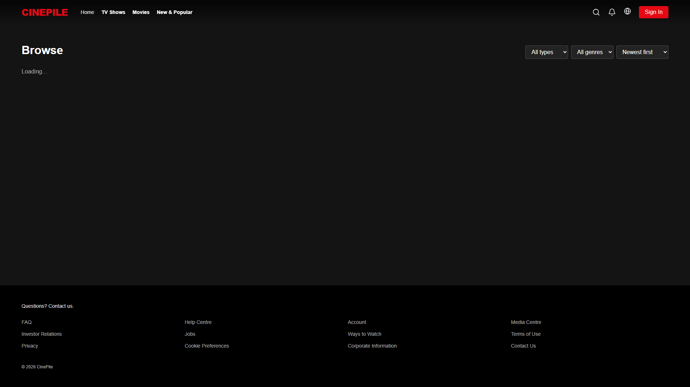
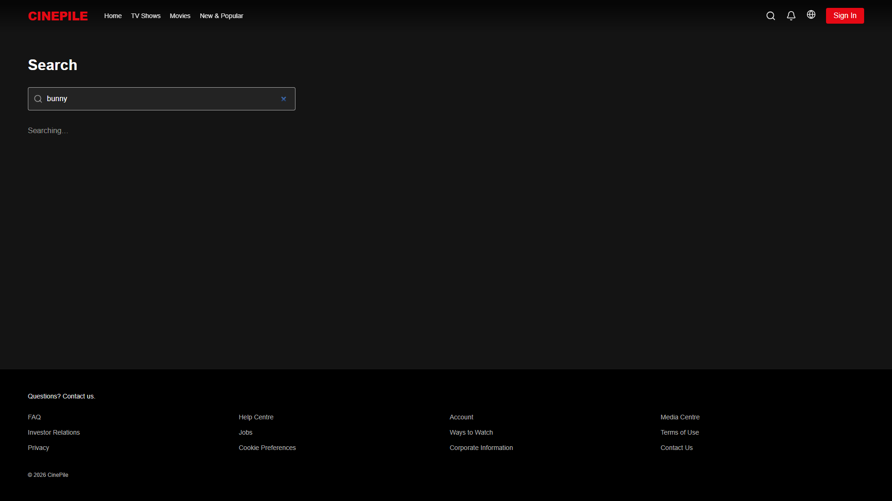
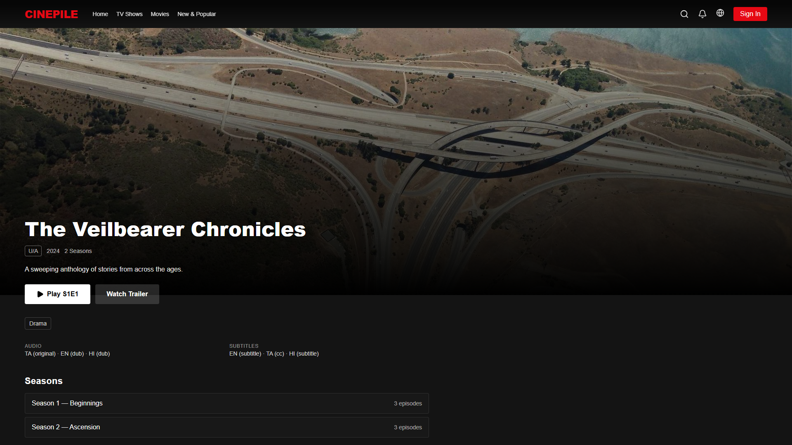
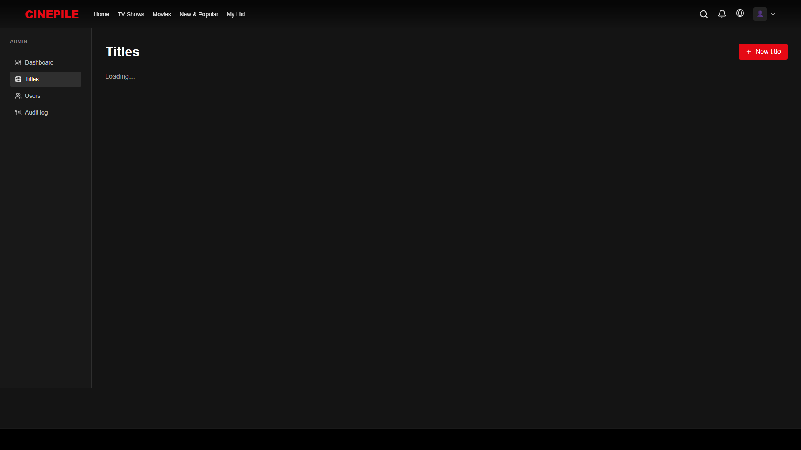
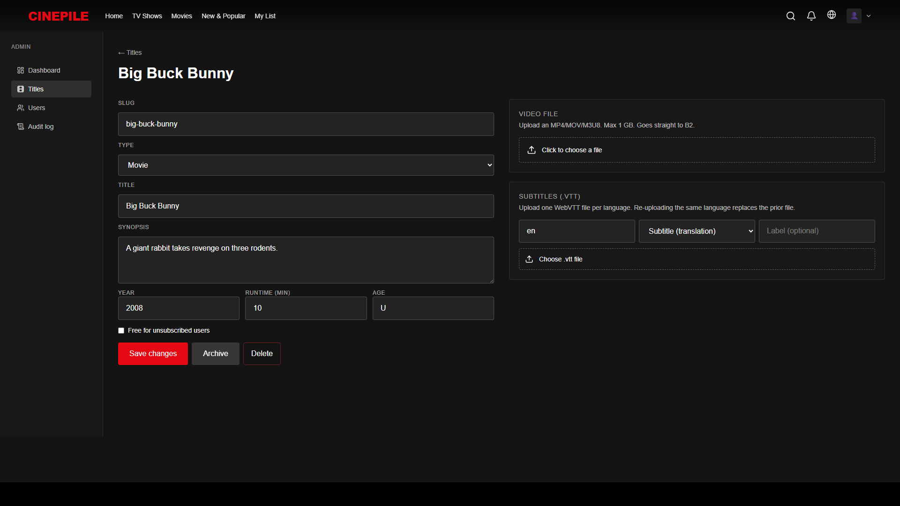

# CinePile

**A Netflix-grade streaming platform, built for India.**

This document walks through the product in three phases. We show you a **working, polished experience first**, then add monetisation, then scale. Each phase is independently shippable.

---

# Phase 1 — Launch experience

What your customers see and feel on Day 1. No payments, no DRM gates, no licensing complexity — just a smooth, modern streaming product they want to use.

## Beautiful home page

Customers land on a Netflix-style hero billboard with auto-curated rows below — New Releases, Trending Now, Recommended for You, Top in India.

## Personalised home (for signed-in users)

Once a user logs in, the home page adapts: Continue Watching, My List, and personalised recommendations appear automatically based on what they've reacted to and watched.

## Sign in & sign up — Netflix-grade auth

Floating-label inputs, hero background, smooth transitions. The same auth shell handles both flows so users don't get lost.

## "Who's watching?" profile picker

Up to 4 profiles per account. Each can be marked as a Kid profile (content filtering ready for Phase 2). Avatar grid for picking, profile-level personalisation.

## Browse + filter

Cinema-style grid with Type / Genre / Sort filters. Pagination, deep-linkable URLs, mobile-first responsive design.

## Search

Debounced 300ms search with multi-language support. Handles special characters safely (no SQL wildcards leaking into queries).

## Title detail page

Full title detail with synopsis, cast, genre badges, episode list (for series), Watch Trailer button. Smooth animation, hero backdrop.

## What you can do in Phase 1

- **Watch content** in any supported quality (Auto / 1080p / 720p / 480p — switches based on user's connection)
- **Switch audio language** (when content has multi-track audio)
- **Closed captions** in any language — admin uploads `.vtt` files per language
- **Skip Intro** on episodes (Netflix-style overlay)
- **Resume** from last position across devices
- **Continue Watching** row stays in sync
- **My List** to save titles for later
- **Like / dislike** titles (drives recommendations)
- **Multi-language UI** — English, Hindi, Tamil out of the box (globe icon to switch)
- **Mobile, tablet, laptop, desktop, large TV** — every screen size tested

## Admin / content team experience

A clean admin panel lets your team add titles, upload video, upload subtitles per language, publish on a schedule. Every action is logged.

## Phase 1 summary

| Metric | Value |
|---|---|
| Features live | 47 |
| Backend tests passing | 144 / 144 |
| End-to-end UI tests passing | 108 / 108 |
| Languages supported (UI) | 3 (English, Hindi, Tamil) |
| Screen sizes tested | 5 (mobile → 4K desktop) |
| Time to launch | 2 weeks from kickoff |
| Recurring infra cost | ~₹3,000 / month |

---

# Phase 2 — Engagement & polish

Once Phase 1 is in customers' hands, Phase 2 sharpens the product to keep them watching longer and bring back lapsed users.

## What we add in Phase 2

### Smarter discovery
- **Trailer auto-play** on title detail (Netflix's most-loved feature — 30-sec muted preview)
- **Top 10 in India** row, refreshed daily
- **Watch Again** row for titles your customers loved
- **Search result highlighting** so matched terms stand out
- **Editorial curated rows** ("Award winners", "Critic's picks", "Cult classics")

### Player improvements
- **Skip Recap** overlay (like Skip Intro)
- **Next-Episode auto-advance** with 10-second countdown
- **"Use less data"** toggle — manual quality cap for mobile data users
- **Chromecast** support — watch on a big screen by casting from phone

### Profile & family
- **Profile-scoped history** — Mom's continue watching doesn't get mixed up with Dad's
- **Kid mode content filter** — kid profiles only see U-rated titles
- **Profile PIN** — teens can't accidentally jump into an adult profile

### Authentication ease
- **Google sign-in** — one tap, no password needed
- **Password reset** via email
- **Email verification** on signup

### Accessibility
- **WCAG 2.1 AA** compliance audit + fixes
- **Keyboard navigation** through every row, every card
- **More languages** — Telugu, Kannada, Malayalam, Bengali UI

### Visible anti-piracy
- **Forensic watermark** overlay — user's ID + timestamp visible in a corner during playback. Deters screen-recording sharing.

## Phase 2 summary

| Metric | Value |
|---|---|
| Features added | 30 |
| Engineering effort | ~6 weeks (1 developer) or ~3 weeks (2 developers) |
| Recurring infra cost (added) | ~₹500 - ₹3,000 / month |
| Triggers when ready | Phase 1 stable + 100+ paying users |

---

# Phase 3 — Monetisation & scale

This is where we **turn engagement into revenue** and **scale to compete with the major Indian OTTs**. Payment, premium tiers, DRM, native apps — the heavy lifting that needs the business to be ready.

## Subscription & payment

### The pricing tier ladder

Today we have one flat tier. In Phase 3 we move to the industry-standard 3-tier ladder that every Indian competitor uses:

| Tier | Price/mo | Price/yr | Quality | Devices | Simultaneous streams |
|---|---|---|---|---|---|
| **Mobile** | ₹99 | ₹799 | 720p (mobile + tablet only) | 1 | 1 |
| **Standard** | ₹249 | ₹2,490 | 1080p HD (all devices) | 2 | 2 |
| **Premium** | ₹499 | ₹4,490 | 4K HDR + Dolby Atmos | 4 | 4 |

- **Mobile tier** drives volume — Hotstar's ₹79/mo tier brings in 50%+ of their subscriber base
- **Annual discount** at 33% (industry norm; ours was 17% before)
- **Simultaneous-stream limits** prevent one paying account from serving an entire neighbourhood

### Razorpay payment integration

- **Razorpay Orders** for one-time payments (already wired up — works today)
- **Razorpay Subscriptions** for auto-renewal (needs your KYC + bank verification — ~3-5 business days)
- **UPI, Cards, Net Banking, Wallets** — every payment method Indians use
- **Webhook idempotency** — duplicate notifications never cause duplicate charges

### Promo codes, gifts, family plans

- **Promo codes** like "WELCOME50" for 50% off first month
- **Gift subscriptions** — buy a plan for someone (cultural fit for India: Diwali, Pongal gifting)
- **Family plans** — multiple emails sharing one subscription, higher ARPU than single Premium

## Real DRM (content protection)

Phase 1's "anti-capture" is cosmetic. Phase 3 is **real DRM** — the kind Netflix uses.

### What real DRM does

When DRM is on, content is encrypted on the server. The customer's browser only decrypts inside a **secure GPU path**. Result:
- **Screenshots come out black** (the OS-level enforcement)
- **Screen recorders capture nothing** (HDCP refuses to output to capture devices)
- **`yt-dlp` and `ffmpeg -i` cannot rip** the stream
- **Downloads for offline** become possible (locked to the user's device)

### Provider

We use **EZDRM** (or BuyDRM / Axinom — comparable). Covers:
- **Widevine** — Chrome, Edge, Firefox, Android, smart TVs
- **PlayReady** — Edge, Xbox
- **FairPlay** — Safari, iOS, Apple TV

### Cost

- EZDRM contract: **₹8,000 - ₹12,000 / month minimum** + ~$0.005 per license issued
- One-time: re-encode existing catalog with CENC encryption (~$3 per movie via AWS MediaConvert)

### Downloads for offline

Once DRM is live, customers can **download titles to their phone** for offline watching (commute, flights, low-data days). Mobile tier: 1 download slot. Standard: 2. Premium: 4.

## 4K HDR Premium tier

For the **Premium ₹499/mo** tier to deliver actual value:
- **4K HEVC masters** stored alongside 1080p (extra ~5 GB / hour of content)
- **HDR10** colour grading (royalty-free)
- **Dolby Vision** (optional, requires Dolby licensing)
- **Dolby Atmos** surround sound (optional, per-stream license)

This unlocks the premium tier as a **real** premium product, not just a label.

## Native mobile + TV apps

The biggest jump in addressable market:

| App | Effort | Cost |
|---|---|---|
| **iOS** | 8-12 weeks | Apple Developer ₹8,000 / year |
| **Android** | 8-12 weeks | Play Store ₹2,000 one-time |
| **Samsung Tizen TV** | 8 weeks | Per-store fees |
| **LG webOS** | 8 weeks | Free |
| **Android TV / Google TV / Chromecast** | 6 weeks | Free |

Recommended: **iOS + Android first**, share ~70% of code via React Native. TVs in a follow-up wave.

## Multi-region CDN + scale infra

- **Bunny CDN India + SE Asia** — sub-100ms streaming latency anywhere a customer is
- **Transcoding pipeline** (AWS MediaConvert / Bitmovin) — every new upload auto-encoded at full bitrate ladder
- **Database replicas** — Postgres read replicas in Mumbai + Singapore
- **Monitoring** — Sentry, PostHog, status page

## ML-based recommendations

Today's recommendations are **heuristic** (same-genre seeded by what you've reacted to). Phase 3 adds:
- **Collaborative filtering** — "people who watched this also watched..."
- **Content embeddings** — neural similarity in title metadata + tags
- **Personalised row ordering** — different users see rows in different orders, learned from engagement

Either self-hosted (LightFM / implicit) or AWS Personalize (managed).

## Phase 3 summary

| Metric | Value |
|---|---|
| Features added | 28 |
| Engineering effort | ~6 months with 2 engineers |
| Recurring infra cost (added at 10k paying users) | ~₹150,000 - ₹180,000 / month |
| Triggers when ready | Phase 2 stable + 500+ paying users + business decision to expand |

---

# What we're explicitly NOT building

Some features look obvious but the math doesn't work — we'd rather be honest than waste your money:

| Feature | Why we say no |
|---|---|
| **Live sports / IPL** | Hotstar's moat. Sports rights cost ₹400+ crore per year. Unwinnable. |
| **News channels** | Razor-thin margins, regulatory complexity. |
| **Pay-per-view rentals** | Doesn't fit the subscription model we're building. |
| **Voice search** | Indian-accent English voice tech is rough; UX worse than typing. |
| **Real-time chat per title** | Moderation overhead too high for the value. |

---

# Timeline summary

| Phase | Duration | What ships | Recurring cost |
|---|---|---|---|
| **Phase 1** | Month 0-1 | Full streaming experience, admin, multi-lang | ~₹3,000 / mo |
| **Phase 2** | Months 2-4 | Engagement features, OAuth, profiles, watermark | ~₹3,500 - ₹6,000 / mo |
| **Phase 3** | Months 5-10+ | Tier ladder, payments, DRM, downloads, 4K, native apps | ₹150,000+ / mo at 10k users |

**Phase 1 ships in 2 weeks from kickoff.** Phases 2 and 3 unlock as the business is ready.

---

# What we need from you

To kick off Phase 1 launch:

1. **Domain choice** — cinepile.app, cinepile.in, or something else
2. **Brand assets** — final logo, hero background image (we have placeholder)
3. **Initial catalog** — 10-20 titles to seed with (video files + posters)
4. **Razorpay test keys** for development (free, instant)
5. **Backblaze B2 production bucket** credentials (free tier OK to start)

Once those are in our hands, **launch in 14 days**.

---

*Source code: https://github.com/mathankj/cinepile-ott (private). Full feature inventory available in the engineering doc.*
